# 2020 2nd TeamH4C CTF

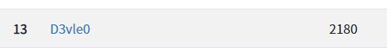

13위 (2180 pts)

## [MISC]

### Did you read the Rules? (100)

`h4c(D0_You_C_Wh4t_1_c?)`

## [CRYPTO]

### The Easiest problem of the universe (50)

`V0hreFpreFdPSFJZTVRobldIa3dkRmd4T0hSWWVUQm5XSGt3ZEZneE9XWlllVEJuV0hrd2RGaDVNSFJZZVRCbldIa3habGg1TVdaWU1UaG5XREU0ZEV4V09IUllNVGhuV0hreFpsZ3hPV1pNVXpBOQ==`  

주어진 문자열을 여러번 base64 decode 하면  

`_-_-_-__ _--__-_- _--____- _--_--_- _-__-___ __--_-__ _-____--` 

가 되는데, `_` 을 0, `-`을 1로 치환해서 string 으로 바꾸면 된다.  

```py
import base64
cp = "V0hreFpreFdPSFJZTVRobldIa3dkRmd4T0hSWWVUQm5XSGt3ZEZneE9XWlllVEJuV0hrd2RGaDVNSFJZZVRCbldIa3habGg1TVdaWU1UaG5XREU0ZEV4V09IUllNVGhuV0hreFpsZ3hPV1pNVXpBOQ=="
for i in range(3):
    cp = base64.b64decode(cp).decode("UTF-8")

cp=cp.replace("_", "0")
cp=cp.replace("-", "1")

for i in range(cp.count(" ")+1):
    print(chr(int(cp.split(" ")[i], 2)), end="")
```

`h4c(TeamH4C)`

## [FORENSIC]

### Find the flag (50)

그냥 열면 된다.

`h4c(i_1ove_hangul)`

### Find Hangul (465)

ftk imager 로 열고 휴지통을 분석한다.  

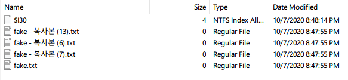

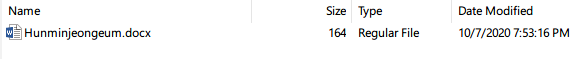
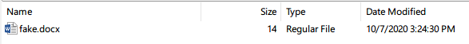
  
로컬로 export 하고 확인해보자.  

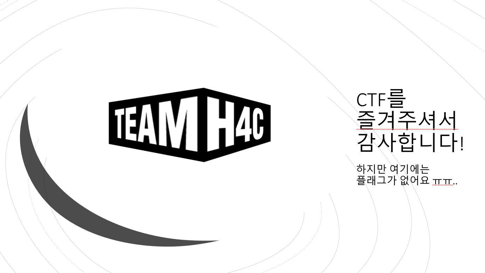

h4c.pptx 에는 아무것도 없고, 

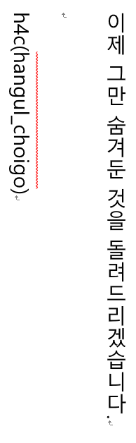

Hunminjeongeum.docx 에는 fake flag가 존재하고, 


fake.docx 역시 아무것도 없다...  

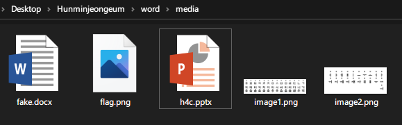

Hunminjeongeum.docx를 뜯어보면 휴지통에서 봤던 나머지 두 파일과 flag.png 파일이 숨겨져있다.  

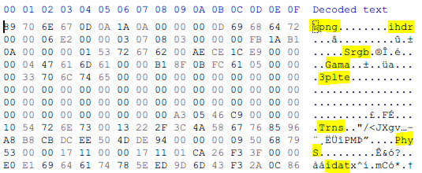

flag.png 헥사값을 보니 헤더와 청크 일부분이 대소문자가 반대로 되어있는걸 알 수 있다. (형광펜 표시)   
```
89 70 6E 67 -> 89 50 4E 47 (‰png -> ‰PNG)
69 68 64 72 -> 49 48 44 52 (ihdr -> IHDR)
53 72 67 62 -> 73 52 47 42 (Srgb -> sRGB)
47 61 6D 61 -> 67 41 4D 41 (Gama -> gAMA)
70 6C 74 65 -> 50 4C 54 45 (plte -> PLTE)
54 72 6E 73 -> 74 52 4E 53 (Trns -> tRNS)
50 68 79 53 -> 70 48 59 73 (PhyS -> pHYs)
69 64 61 74 -> 49 44 41 54 (idat -> IDAT)
69 65 6E 64 -> 49 45 4E 44 (iend -> IEND)
```


파일이 정상적으로 열리고 플래그가 나온다.

`h4c(n4ram4l5am1_dyungu1g3_d4r4)`

### GNP (496)

  

위 이미지가 주어진다.

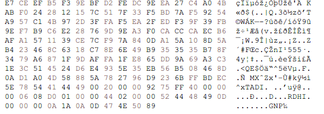  

jpg file ending 인 FF D9 뒤에 PNG 파일이 byte 단위로 거꾸로 덮여있다.

```py
f=open('flag.png', 'rb')
data=f.read()
rev_data=data[::-1]
e=open('new.png', 'wb')
e.write(rev_data)
e.close
```

new.png 를 만들어주고 stegsolve로 열자.  

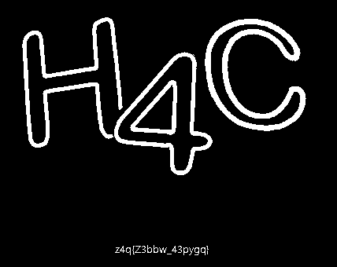  

`z4q(Z3bbw_43pygq)` 라는 문자열이 나오는데, caesar 랑 vigenere cipher 둘다 아니어서 삽질좀 했다.

affine cipher 브포하면 A=7, B=2일때 `h4c(H3llo_43nsic)` 가 된다.  

`h4c(H3llo_43nsic)`

### Dark Light (499)

  

위 이미지가 주어진다.  

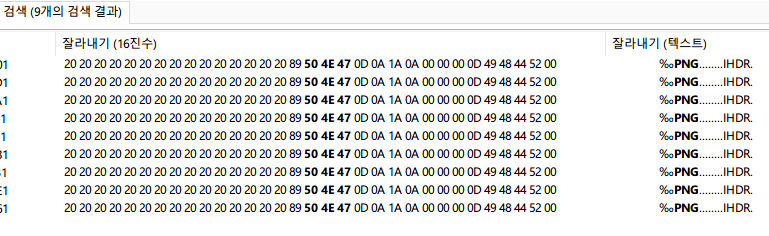  

이번에도 FF D9 아래에 많은 PNG 파일들이 숨어있다.
모든 이미지들이 qr코드로 되어있는데, 등잔밑이 어둡다 라는 힌트와 함께 fake flag가 인식된다.  

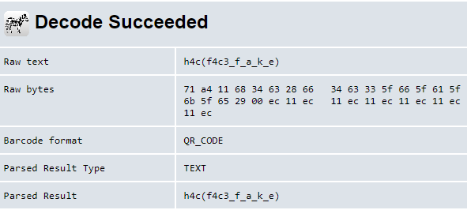 

fake flag가 인식되는 파일의 height를 늘려주면 된다.  

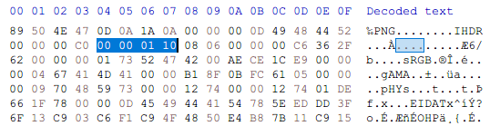 

PNG 파일의 0x14~0x17 자리가 height 에 해당한다. 적당히 0x00000110 정도로 늘렸다.


`h4c(g0t_y0u)`

### simple_forensic (500)

암호화가 된 simple_forensic.zip 이 주어진다. fcrackzip 으로 간단하게 풀어보자.  

```shell
fcrackzip -b -c a1 -v -l 4 -u simple_forensic.zip
```

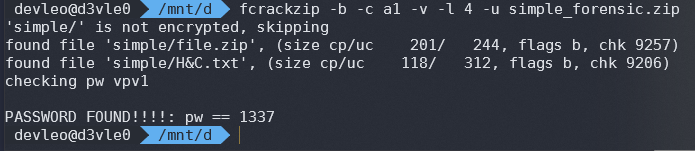
  
압축을 풀면 file.zip과 H&C.txt 파일이 나오는데, H&C.txt 내용은 아래와 같다.  

```
HHH KKKK
HKK HHH
HKHH HHH KKH
HKH HK HHH KHH
HH HHH KHK KKK K
HKHK HHH HKK K
KKHHKK
KKHK KHKK KH HHK
KK KKK
HK HHH H

KKKK KKKKH HKHK { KKK HHH KHK KHK HKHH KKHHKH H KKKK KK KKK KKHHKH KK KKK KKHHKH HK HHH H KKHHKH KH KKHHKH KKHK KHKK KH HHK }

KK
KHKK KK HKH K
KHH KKKK KK H K
KKK KHHK KH HKHK K
```

문자열의 형태를 보고 모스부호임을 바로 알았다.

```py
cp="""HHH KKKK
HKK HHH
HKHH HHH KKH
HKH HK HHH KHH
HH HHH KHK KKK K
HKHK HHH HKK K
KKHHKK
KKHK KHKK KH HHK
KK KKK
HK HHH H

KKKK KKKKH HKHK { KKK HHH KHK KHK HKHH KKHHKH H KKKK KK KKK KKHHKH KK KKK KKHHKH HK HHH H KKHHKH KH KKHHKH KKHK KHKK KH HHK }

KK
KHKK KK HKH K
KHH KKKK KK H K
KKK KHHK KH HKHK K"""
tmp=cp.replace("H", "_")
tmp=tmp.replace("K", '.')
print(tmp)
```

```
___ ....
_.. ___
_.__ ___ .._
_._ _. ___ .__
__ ___ ._. ... .
_._. ___ _.. .
..__..
.._. ._.. ._ __.
.. ...
_. ___ _

.... ...._ _._. { ... ___ ._. ._. _.__ ..__._ _ .... .. ... ..__._ .. ... ..__._ _. ___ _ ..__._ ._ ..__._ .._. ._.. ._ __. }

..
._.. .. _._ .
.__ .... .. _ .
... .__. ._ _._. .
```

`OHDOYOUKNOWMORSECODE?FLAGISNOTH4C{SORRY_THIS_IS_NOT_A_FLAG}ILIKEWHITESPACE`

fake flag와 I like whitespace 라는 문구가 보이는데, 아까 남은 file.zip의 압축을 풀어보자.  
그러나 file.zip은 비밀번호가 걸린 것이 아닌, 헥사값을 수정해서 비밀번호가 걸린 것 처럼 보이는 것이다.  

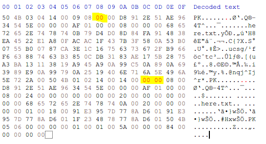

표시된 부분과 같이 수정하면 here.txt 를 볼 수 있다.  
There is a flag in this sentence 라는 문자열이 있는데, 이 몇글자가 431bytes 나 된다..!

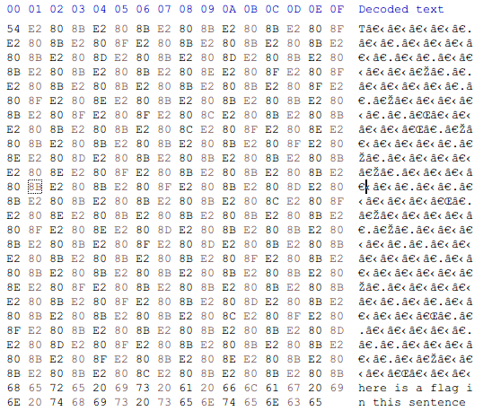

이렇게 zero-width space 들이 들어가있다.  

http://offdev.net/demos/zwsp-steg-js 에서 zero width space steganography decoder을 사용해 flag를 얻으면 된다.  

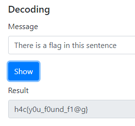

`h4c{y0u_f0und_f1@g}`

## [SURVEY]

### Survey (20)

`h4c(see_ya_next_time!)`

한 수 배워갑니다 :)