# Layer7 & Trust Internal CTF

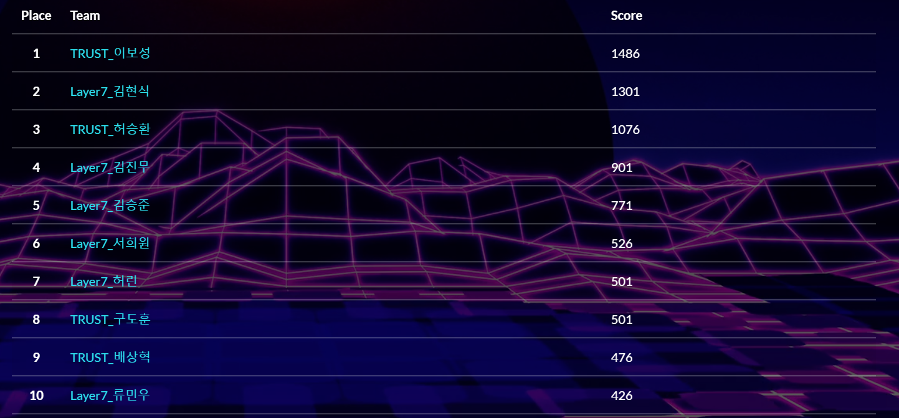

순위: 9위  

---

## pwn - lol [50]

```c
// gcc main.c -o lol -fpie -pie -z relro -z now

#include <stdio.h>
#include <stdlib.h>
#include <fcntl.h>

char data[80];
char flag[80];

void init_proc()
{
    setvbuf(stdin, 0, 2, 0);
    setvbuf(stdout, 0, 2, 0);
    setvbuf(stderr, 0, 2, 0);

    int fd = open("./flag", O_RDONLY);
    if (fd<0)
    {
        puts("Cannot open flag!");
        exit(-1);
    }
    read(fd, flag, 80);
    close(fd);
}

int menu()
{
    puts("[R]ead Data");
    puts("[W]rite Data");
    puts("[E]xit");
    printf(">> ");
}

void readData()
{
    int len, res;
    
    printf("Length : ");
    scanf("%d", &len);

    if (len<0 && len>80)
    {
        puts("Bad length\n");
        return;
    }

    printf("Data : ");
    res = read(0, data, len);

    printf("Data read : %d bytes\n\n", res);
    return;
}

void writeData()
{
    int len, res;
    
    printf("Length : ");
    scanf("%d", &len);

    if (len<0 && len>80)
    {
        puts("Bad length\n");
        return;
    }

    printf("Data : ");
    res = write(1, data, len);

    printf("Data written : %d bytes\n\n", res);
    return;
}

int main()
{
    char choice[0x8] = {NULL, };

    init_proc();
    while (1)
    {
        menu();
        read(0, choice, 8);

        switch (choice[0])
        {
            case 'R':
                readData();
                break;
            case 'W':
                writeData();
                break;
            case 'E':
                exit(0);
                break;
            default:
                puts("Invalid option\n");
                break;
        }    
    }
}
```

`writeData()` 함수에서 데이터를 읽어들일 길이를 1~80으로 제한하는 듯 보이지만 `and` 연산을 하고 있어 80보다 큰 값을 넣을 수 있다.  

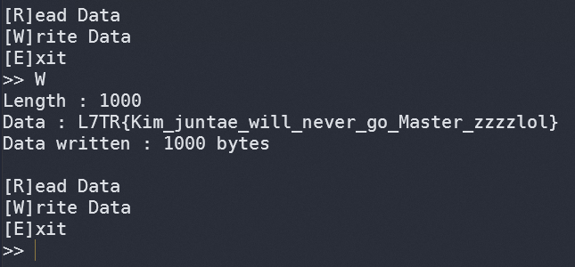

`L7TR{Kim_juntae_will_never_go_Master_zzzzlol}`

## rev - warmup [50]

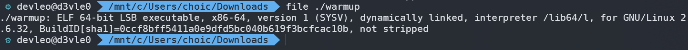

64 bit  

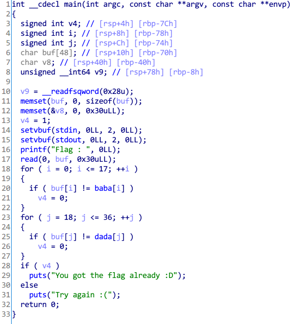

ida 로 까면 위와 같이 나오는데 인덱스 0부터 17까지는 `baba`와 같아야 하고, 18부터 36까지는 `dada`와 같아야 한다.  

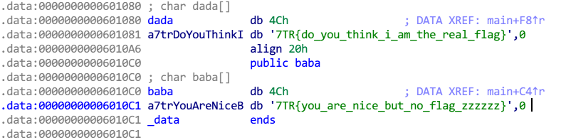


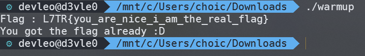

따라서 플래그는 `L7TR{you_are_nice_i_am_the_real_flag}`

## rev - KAPKA [100]

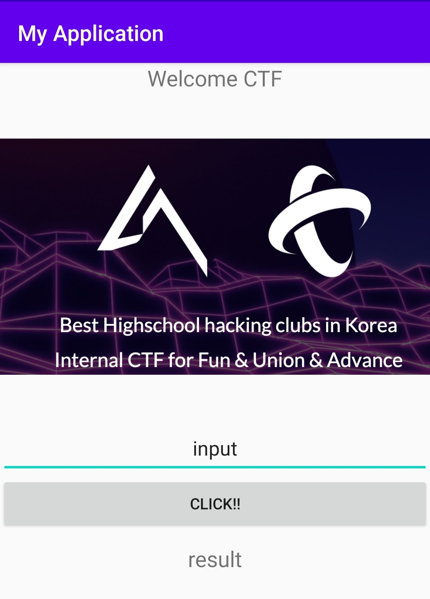

apk 파일이 주어지는데, `input`에 적절한 값을 넣어야 하는것으로 보인다.

```java
package com.example.myapplication;

import android.os.Bundle;
import android.util.Log;
import android.view.View;
import android.view.View.OnClickListener;
import android.widget.Button;
import android.widget.TextView;
import androidx.appcompat.app.AppCompatActivity;

public class MainActivity extends AppCompatActivity {
    /* access modifiers changed from: protected */
    public void onCreate(Bundle savedInstanceState) {
        super.onCreate(savedInstanceState);
        setContentView((int) C0263R.layout.activity_main);
        final TextView inputtext = (TextView) findViewById(C0263R.C0265id.editTextTextPersonName);
        final TextView resulttext = (TextView) findViewById(C0263R.C0265id.textView2);
        ((Button) findViewById(C0263R.C0265id.button)).setOnClickListener(new OnClickListener() {
            public void onClick(View v) {
                String strData = inputtext.getText().toString();
                char[] array_word = new char[strData.length()];
                for (int i = 0; i < array_word.length; i++) {
                    array_word[i] = strData.charAt(i);
                }
                String result = "";
                for (int i2 = 0; i2 < strData.length(); i2++) {
                    StringBuilder sb = new StringBuilder();
                    sb.append(result);
                    sb.append((char) (array_word[i2] ^ i2));
                    result = sb.toString();
                }
                Log.d("tmp", result);
                if (result.equals("L6VQr6pWIdo~=?kORRW`'vL+h:=<?b")) {
                    resulttext.setText("!!CONGRATULATION!!");
                } else {
                    resulttext.setText("NONO~~ NO HACK");
                }
            }
        });
    }
}
```

디컴파일한 `MainActivity.java` 이다.  
입력한 문자열의 길이만큼 `array_word`를 선언하고 그 값을 넣는다.  
문자열의 길이만큼 반복문을 돌며 `array_word[i2] ^ i2` 를 하는데, 그 결과값이 아래에 나와있다.  

```py
cp = "L6VQr6pWIdo~=?kORRW`'vL+h:=<?b"
for i in range(len(cp)):
    print(chr(ord(cp[i]) ^ i), end="")
```

`L7TR{w0w_@ndr01d_C@lCu1aT2r!!!!}`

## misc - Sanity Check [50]

`L7TR{this_is_nc(wikipedia.org/wiki/Netcat)}`

## misc - padding [50]

```py
#!/usr/bin/env python2.7
# -*- coding: utf-8 -*-

import sys

FLAG = open('./flag', 'r').read()
MENU = '''1. base64 encode
2. base64 decode
>> '''

def send(msg):
    sys.stdout.write(msg)
    sys.stdout.flush()

def menu():
    send(MENU)
    return int(raw_input())

def myEncode():
    send('Msg : ')
    msg = raw_input()
    enc = msg.encode('base64').strip()
    send('Encoded : ' + enc + '\n\n')

def myDecode():
    send('Encoded : ')
    enc = raw_input()
    msg = enc.decode('base64')
    send('Msg : ' + msg + '\n\n')

    new_enc = msg.encode('base64').strip()
    if len(enc) != len(new_enc):
        send(FLAG+'\n')
        sys.exit(0)


if __name__ == '__main__':
    while True:
        opt = menu()

        if opt == 1:
            myEncode()
        elif opt == 2:
            myDecode()
        else:
            send('Invalid Option\n\n')
```

`myDecode` 함수에서 입력받을때 임의의 문자열 몇개를 넣고 '==' 를 붙이거나 플래그가 나오지 않는다면 띄어쓰기 한칸을 넣었더니 풀렸다.  
출제자의 정확한 의도를 알아봐야겠다.  

`L7TR{hope_you_understand_the_padding_now_:D}`

## misc - Calc [50]

사칙연산이 주어지는데 답이 자연수가 아닌 경우에 'x' 를 보낸다. 또한 나머지 기호는 사칙연산에 포함되지 않으므로 % 연산자가 나오면 'x' 를 보낸다.  
```py
from pwn import *
import sys
p = remote("ooooo.pw", 40003)

p.recvuntil("START!!\n")
for i in range(100):
    math = p.recvuntil("\n")[:-1]
    print(math)
    if math[2] == "/":
        if int(math[0]) % int(math[4]) != 0:
            p.sendline("x")
        else:
            p.sendline(str(eval(math)))
    elif math[2] == "%":
        p.sendline("x")
    else:
        try:
            if eval(math) <= 0:
                p.sendline("x")
            else:
                p.sendline(str(eval(math)))
        except SyntaxError:
            sys.exit(0)
```
`L7TF{%_IS_NOT_FOUR_FUNDAMENTAL_ARITHMETIC_OPERATOR_ZzzZZZZZ}`

## misc - 플래그 뿌리는 문제 [50]

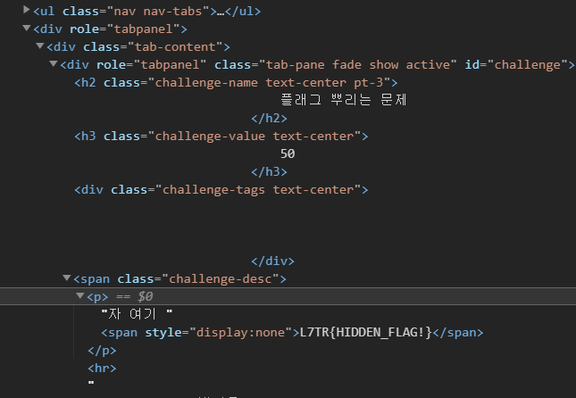

`L7TR{HIDDEN_FLAG!}`

## misc - TRUST [75]

`trust.docx` 가 주어진다.


docx 문서 안에 있는 문자열은 가짜 플래그이다.


`TRUST.zip` 이 숨겨져있는데, 압축을 풀면 수많은 폴더들이 존재한다.  

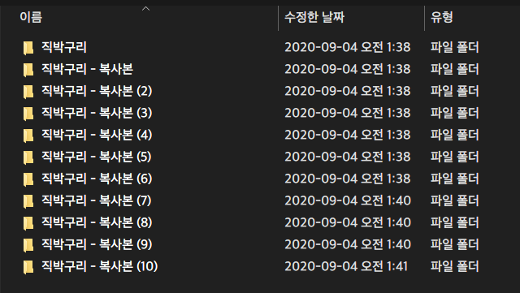

이곳에서 `key.txt` 를 찾으면 된다.

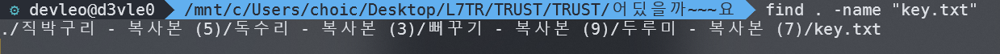

`find . -name "key.txt"`  
텍스트 파일에는 유튜브 링크가 있었고, 영상 설명란에 이미지 파일을 다운받는 링크가 주어졌다.


트러스트 로고 뒤로 서로 다른 확장자를 가진 3개의 파일이 합쳐져 있었다.  

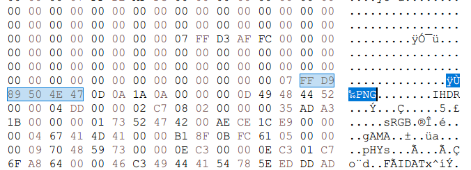
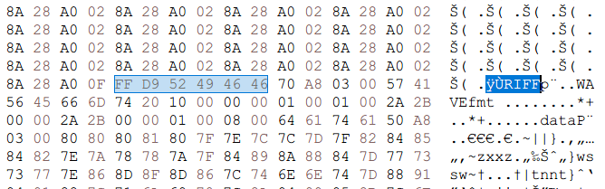
첫번째와 세번째는 플래그가 적힌 이미지파일 이고 두번째는 모스코드가 담긴 오디오 파일이었다.

`L7TR{N0W_Y0U_KN0W_TH3_TRUST}`
