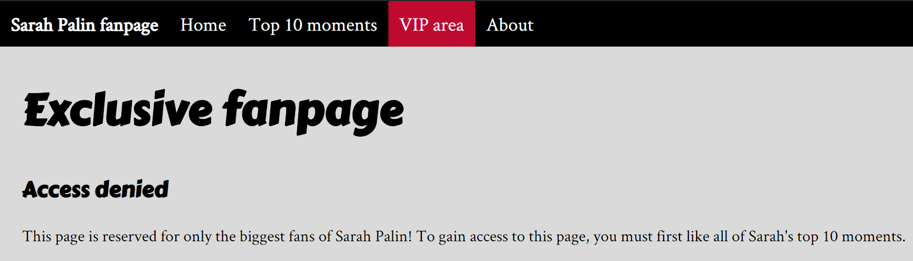
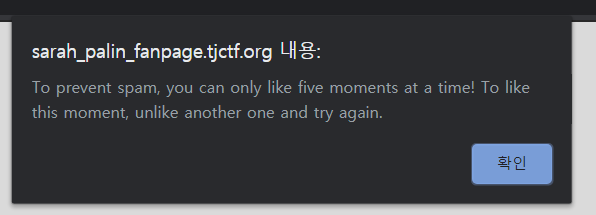
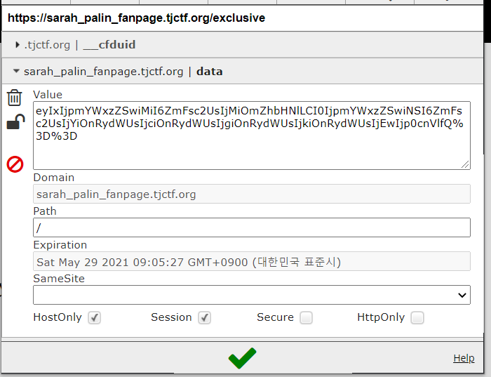
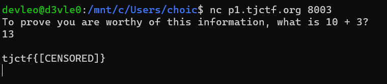
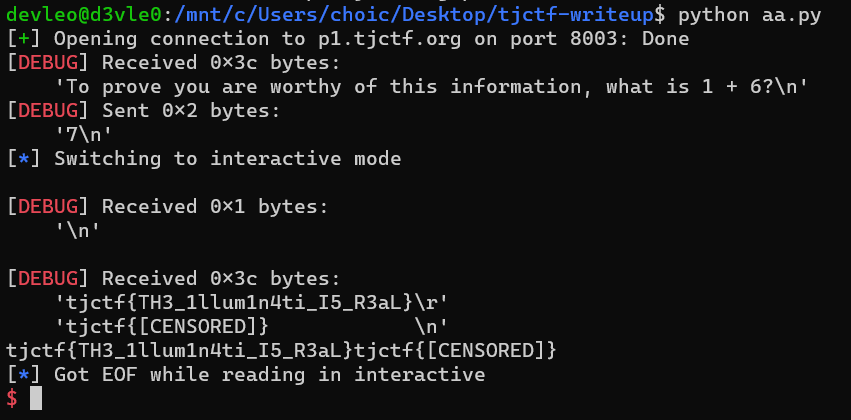
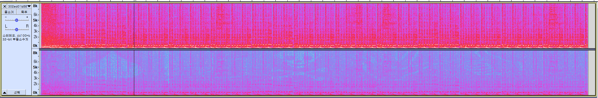
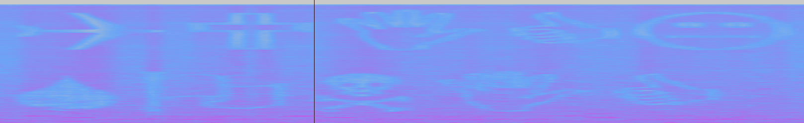

# 2020 TJCTF WriteUp

Team: DIMI_h4ck3r  
Rank: 40th, 1175pts  
Devleo (Captain), CraftyDragon678, n1net4il, NAB33N, $1m0hYA  

---

# Devleo's WriteUp

## [WEB] Sarah Palin Fanpage (35)



VIP area에 접근하기 위해서 top 10 moments 에 좋아요를 모두 눌러야하지만 spamming 을 방지하기 위해 좋아요를 5개 이상 누를 수 없다고 한다.  



쿠키값을 보니 특정 문자열이 base64 encode 되어 있었는데, 결과는 아래와 같다.



```py
import sys
import base64

a = 'eyIxIjpmYWxzZSwiMiI6ZmFsc2UsIjMiOmZhbHNlLCI0IjpmYWxzZSwiNSI6ZmFsc2UsIjYiOnRydWUsIjciOnRydWUsIjgiOnRydWUsIjkiOnRydWUsIjEwIjp0cnVlfQ=='.encode('utf-8')
print(base64.b64decode(a))
```

`{"1":false,"2":false,"3":false,"4":false,"5":false,"6":true,"7":true,"8":true,"9":true,"10":true}`  

값을 모두 true로 바꾸고 base64 encode 한 뒤 쿠키를 보내면 플래그가 나온다.

`tjctf{C4r1b0u_B4rb1e}`

## [Cryptography] RSABC (50)
```
n=57772961349879658023983283615621490728299498090674385733830087914838280699121
e=65537
c=3691388536666610243828873295397779835256114629872552488180584049776244882813
```
간단한 RSA 문제다.

```py
from Crypto.Util.number import inverse

n = 57772961349879658023983283615621490728299498090674385733830087914838280699121
e = 65537
c = 36913885366666102438288732953977798352561146298725524881805840497762448828130

p=202049603951664548551555274464815496697
q=285934543893985722871321330457714807993

phi=(p-1)*(q-1)

d=inverse(e,phi)

m=pow(c,d,n)
print(hex(m))[2:-1].decode('hex')
```

n을 소인수분해 하면 위의 p와 q의 곱으로 나타낼 수 있고 일반적인 RSA 알고리즘으로 풀어나가면 된다.  

`tjctf{BOLm1QMWi3c}`

## [MISC] Censorship (30)



제대로 된 답을 입력했음에도 플래그가 censored 되었다. 문제 설명에서 He left a message, but the government censored him! 을 보고 interactive 로 실행했다.  

```py
from pwn import *
context.log_level = 'debug'
p=remote('p1.tjctf.org', 8003)

p.recvuntil('what is ')
math=p.recvuntil('?')[:-1]
p.sendline(str(eval(math)))

p.interactive()
```
<del>간단한 덧셈 한번 하기 싫어서 굳이 자동화하는 코딩충</del>



`tjctf{TH3_1llum1n4ti_I5_R3aL}`

## [Forensic] Rap God (40)
mp3 파일을 주는데 자세히 들어보면 오른쪽 사운드에 노이즈가 들어가있다. 이를 스펙트로그램으로 분석했더니...



특정 기호들이 나온다. 더 자세히 보기 위해 범위를 늘려보자.



wingdings decoder 로 위의 메세지를 해석하면 플래그가 된다.

`tjctf{QUICKSONIC}`

## [Forensics] Hexillology (25)


왼쪽에서 오른쪽으로 각각의 색상값을 추출하면  
746a63 74667b 70594a 726651 4b3064 626154 50477d 인데, 이를 hex to str 하면 된다.  

```py 
'746a6374667b70594a7266514b306462615450477d'.decode('hex')
```

`tjctf{pYJrfQK0dbaTPG}`

원래는 플래그가 `tjctf{c0lorfu1_fl4g!}` 였으나 중간에 변경되었다.