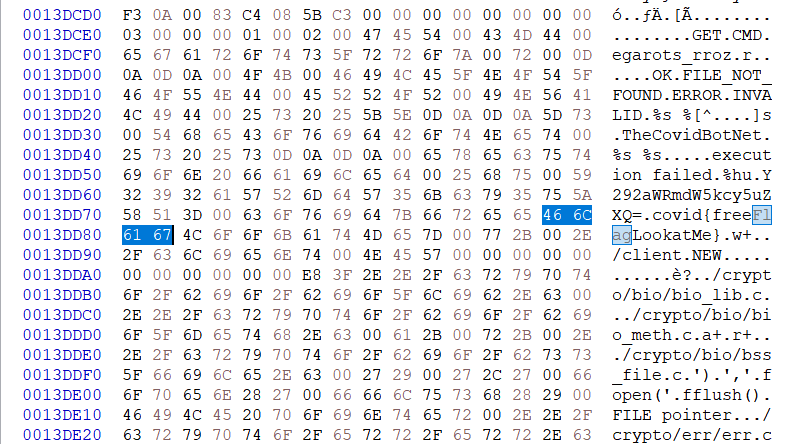
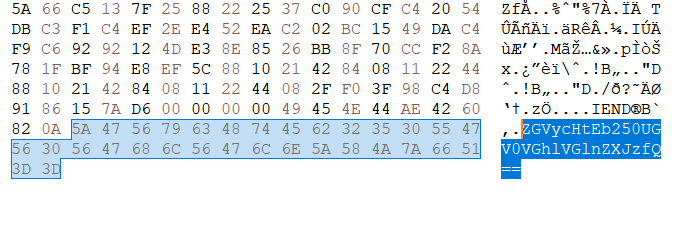

# DerpCon - COVID19 CTF
---
Team: 31337_h4ck3r (Devleo, CraftyDragon678)

## Free Flag (1)
just simply open the binary file

`covid{freeFlagLookatMe}`

## Arch (5)
`x86`

## Do you feel me? (10)
`⠙⠑⠗⠏{⠊⠓⠁⠧⠑⠕⠗⠊⠛⠊⠝⠎⠊⠝⠞⠓⠑⠋⠗⠑⠝⠉⠓⠁⠗⠍⠽⠂⠦⠂⠔}`  
I could guess it is a braille according to the title.  
`DERP{IHAVEORIGINSINTHEFRENCHARMY}`  

## n Eggs (10)
AAABBAABAABAAABABBBB ABAAA ABABBABBBABABABAABAA AAAABAAAAAAAABAABBBAABBAB  
Baconian Cipher decode  
`DERPILOVEBACON`

## All about that base (10)
ZGVycHtJc1RoaXNFbmNyeXB0aW9ufQ==  
base64 decode  
`derp{IsThisEncryption}`  

## All about that base remix (10)
MRSXE4D3KRUGS42JONCGKZSFNZRXE6LQORUW63RBPU======  
base32 decode  
`derp{ThisIsDefEncryption!}`

## et tu brute (10)
qrec{NaByqvrOhgNTbbqvr}  
Caesar Cipher (key=13)  
`derp{AnOldieButAGoodie}`

## Non-standard NetBIOS Name (10)
?=?>@;@9;F@<@=?:@=?B?H?G;F<<<9<9  
just simply put in here https://gchq.github.io/CyberChef/  
key=57  
`derp-station-300`

## Why are they even in that order in the fist place? (10)
4:5:18:16:12:15:14:7:5:19:20:3:15:13:2:15:5:22:5:18  
It's alphabet number (a=1,b=2,c=3 ...)  
`DERPLONGESTCOMBOEVER`

## test_target (5)
Install wireguard and edit network config.  
https://derp.runcode.ninja/profile This page has my config file.  
There's flag.txt file in http://10.0.84.15  
`derp{yay_you_did_it}`

---

I solved these probs after the ctf ended!:  

## Something Derpy
https://www.randori.com  
When you view-source here, ` <!-- something is derpy with this image, will fix later -->`  
It says this is an DERPY image, so open with HxD.  
  
It contains base64 encoded ciphertext below IEND.  
`derp{DontPetTheTigers}`

## Tom Nook - Internet traffic - Part I
Open <a href="./bin/WhatInTheExfil.pcap">this file</a> with wireshark and follow TCP or HTTP stream.  
`DERP{WayToCatchMyForeignServer}`
