# Devleo-ctf WriteUp

## ANG
사진 위로 적힌 ang 의 개수가 비밀번호라고 한다.  
비밀번호 = 420  
빌리 헤링턴 이미지 (ang.png) 를 ang.zip 으로 바꾸고 압축을 풀면 ang.exe 가 나온다.  
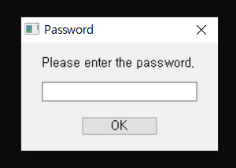  
420 을 입력하면 유사 디도스를 날리는 툴이 실행되는데, exe 파일을 간단하게 메모장으로 열면 ang.bat 라는 문자열이 보인다. 이는 bat 파일을 ang.exe 로 바꿨다는 것을 알 수 있다.  
bat to exe 파일에 비번을 걸었다는 것은 소스코드를 숨기기 위함인데, 그럼 원본 bat 파일의 소스코드를 찾아야 한다.  

AppData\Local\Temp 경로에 수정된 날짜 기준으로 정렬하면 XXXX.tmp 형식의 폴더가 나오는데, 이 안에 원본 bat 파일이 저장된다. (bat 파일 특성)  
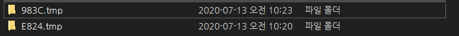  
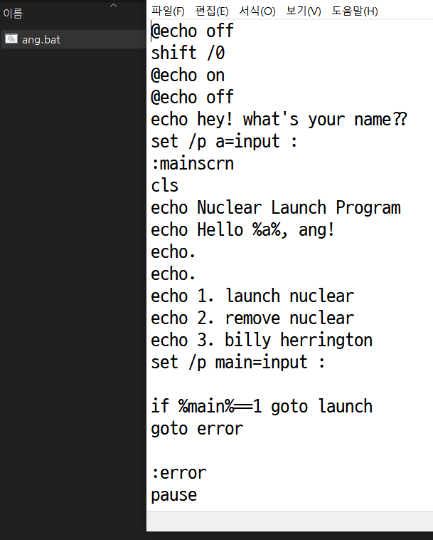  

이렇게 소스를 뜯을 수 있는데, 맨 밑에 주석으로 `ctf2.devleo.us/@ng_b1llyh3rr1ngt0n_@ng` 가 쓰여있다.  

저 링크로 들어가면 ANG 이 엄청나게 많이 쓰여진 기괴한 사이트가 나오는데, 아무것도 없다고 한다.  
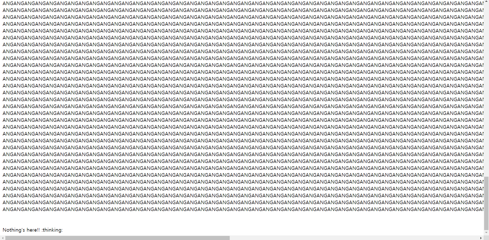  

그러나 브라우저에서 현재 접속중인 주소와 bat 파일 주석에 달린 링크를 비교해보자.  
브라우저: ctf2.devleo.us/@ng_b1llyh3rringt0n_@ng  
주석: ctf2.devleo.us/@ng_b1llyh3rr1ngt0n_@ng  

중간에 한 글자가 다르다...
주석에 쓰인 링크를 view-source 하면 
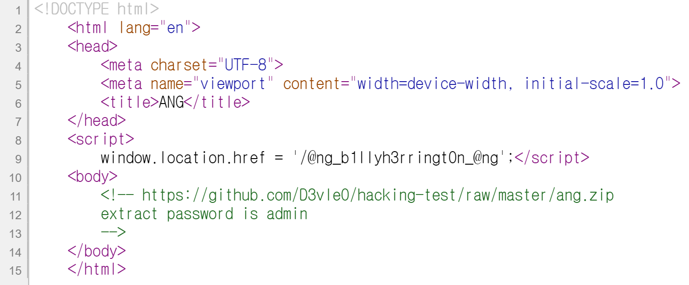  
자동으로 ANG 이 엄청 많이 쓰여진 링크로 redirect 시키는 구조이다. 이곳에 주석으로 ang.zip 파일을 하나 주고 extract password 는 admin 이라고 한다.  
  
(여기서 fcrackzip 으로 extract password bruteforce 를 시키거나 zip file signature의 FLAG 부분 수정해서 비번 걸린 것 처럼 위장시켜도 좋을 것 같다는 생각을 나중에 하게 되었다.)

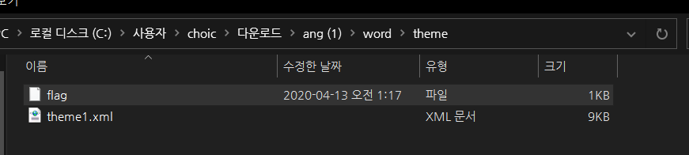  
word/theme 폴더로 들어가면 flag 파일이 있는데,  
열면 

`a5d4a7bb8bba7f0d01aa1faa2fcc6c0f` 가 나온다. https://md5hashing.net/ 에서 md5 decode 를 하자.  
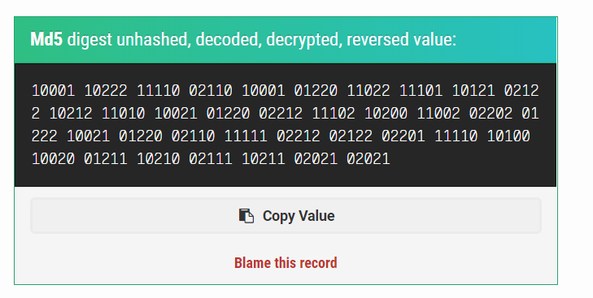  
```
10001 10222 11110 02110 10001 01220 11022 11101 10121 02122 10212 11010 10021 01220 02212 11102 10200 11002 02202 01222 10021 01220 02110 11111 02212 02122 02201 11110 10100 10020 01211 10210 02111 10211 02021 02021
```

숫자들의 구성을 보아, ternary decode 를 하자.  
10진수로 바꾸면 모든 숫자가 2^0 ~ 2^7-1 범위에 있는 것으로 보아 ascii code 이다.  

```py
print(''.join([chr(int(i)) for i in '82 107 120 66 82 51 116 118 97 71 104 111 88 51 77 119 99 110 74 53 88 51 66 121 77 71 73 120 90 87 49 102 67 103 61 61'.split()]))
 ```

결과는 RkxBR3tvaGhoX3MwcnJ5X3ByMGIxZW1fCg== 가 나오고, base64 decode 하면   

`FLAG{ohhh_s0rry_pr0b1em_`  

플래그의 일부분이 나왔다.  
그럼 나머지 하나는 어디 있을까?  
아까 받았던 압축파일을 자세히 보면 구조가 docx 파일 형식으로 되어 있다.  
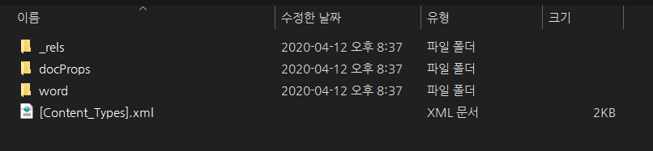  
따라서 ang.zip 을 .docx 로 열어봐야 하지만, 열리지 않는다. (사실 열릴 때도 있고 안 열릴 때도 있다.)  
정석 풀이법은 word/document.xml 파일을 잘 보면 모든 내용이 ANG 이지만 딱 한 줄만 다른 내용이 있다.  
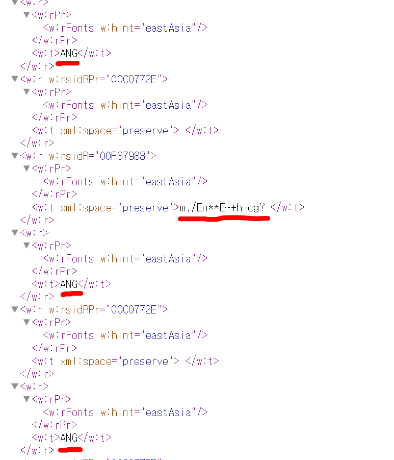  

`m./En**E~+h-cg?` 문자열은 xor_app 이라는 프로그램으로 decode 할 수 있는데, 0x00 ~ 0xFF 범위 자동 xor 연산을 해준다.  
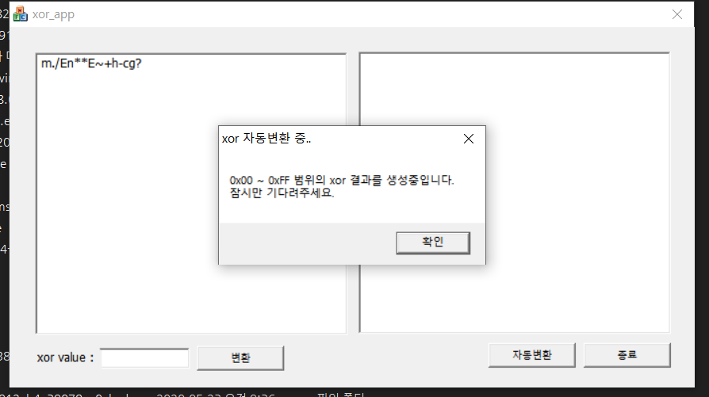  

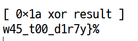    

결과들을 잘 찾아보다 보면 말이 되는 문자열이 있는데 이것이 두번째 플래그 조각이다.  
따라서 최종 답은  
  
`FLAG{ohhh_s0rry_pr0b1em_w45_t00_d1r7y}`

해킹 기법이 사용된 문제라기 보다는 이런 문자열을 보고 어떤 형식으로 암호화가 되어있는지, 그리고 약간의 눈썰미가 필요로 한 이벤트 문제였다.