# Trust & Stealth Freshman CTF  

19기 신입생들을 대상으로 진행한 CTF이다.  
(3.22 10:00 ~ 3.24 22:00)  

# MISC

## MIC CHECK (10000)

> `FLAG{W2lC0m2_fR2shM@n_Ctf}`

## Guessing_1 (100)

플래그는 없습니다  
> `FLAG{없습니다}`

## Guessing_2 (100)

플래그는 진짜 없습니다.  
> `FLAG{}`

## Guessing_3 (100)

> `FLAG{???}`

## QRCODE_1 (100)

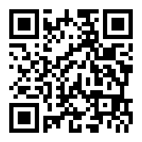

qr코드를 인증하면 유튜브 영상이 나오는데, 설명란에 플래그가 있다.

> `FLAG{W2lC0me_TrUsT_St2@lth_Ctf}`

## QRCODE_2 (150)


위치찾기 심볼을 빈 공간에 붙여넣기 하면 인증된다.

> `FLAG{W0w_U_R_S0_g2nius}`

## QRCODE_3 (200)

여러개의 QR code 이미지를 합치면 된다.


> `FLAG{H@w_U_S2t_Tr@nsp@r2ncy?!?!}`

## QRCODE_4 (150)


qrcode 를 찍으면 hint : stegano 라는 문자열이 나온다.
이미지의 hex 값을 보면 플래그가 있다.

> `FLAG{h@L10_sT2g@n0gr@ph1c}`

## QRCODE_5 (300)

```
슬퍼하지마~ nono~ 열심히 하는 사진을 별 gram~
```

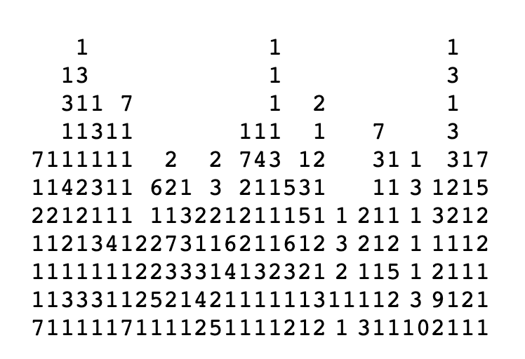


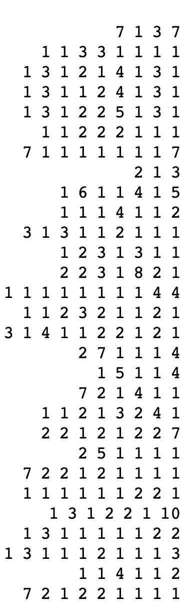

문제에 힌트가 있는데, 이는 nonogram 문제이다.  
http://a.teall.info/nonogram/ 에서 풀 수 있다.  

처음에 qrcode 인증이 안되길래 사이트의 nonogram의 회색 부분을 검정색으로 바꿨더니 인증이 되었다.


> `FLAG{n0nOGram}`

## 플래그 뿌리는 문제 (100)


소스코드에 플래그가 안보이도록 가려져 있는 코드가 있다.


> `FLAG{hidden_Flag^^}`

## n0's Math Class (150)

nc dets.kro.kr 1004 에 접속하면 간단한 덧셈 300문제가 주어진다.  
pwntools 로 간단한 python 코드를 만들어 플래그를 얻을 수 있다.  

```
from pwn import *
p=remote("dets.kro.kr", 1004)
p.recvuntil('-)\n\n')

for i in range(1, 301):
    p.sendline(str(eval(p.recvuntil('= ')[:-2])))
print p.recvuntil('}')
```


> `FLAG{W31C0m3_SmART_fr3sHmAN!_:)}`

## 보이지 않아요. (100)

이미지 파일을 주는데, 아무것도 보이지 않는 까만 사진이다.
Stegsolve로 열면 플래그를 확인 가능하다.

```
java -jar Stegsolve.jar
```

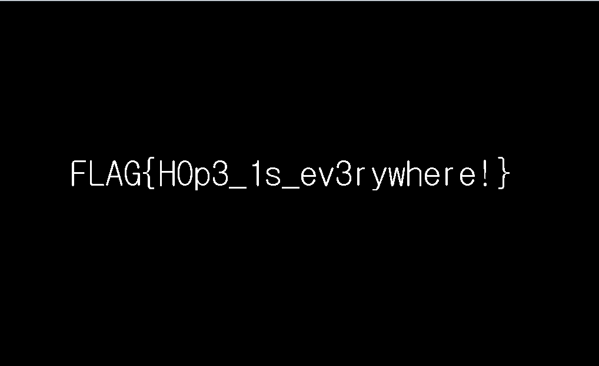

> `FLAG{H0p3_1s_ev3rywhere!}`

## CTF_회의기록_유출본.pptx (100)

ppt 파일을 주는데 6슬라이드에 있는 사진을 치우면 플래그가 숨겨져있다.

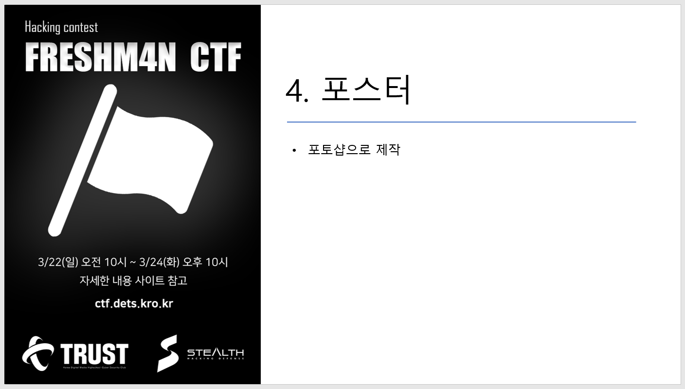

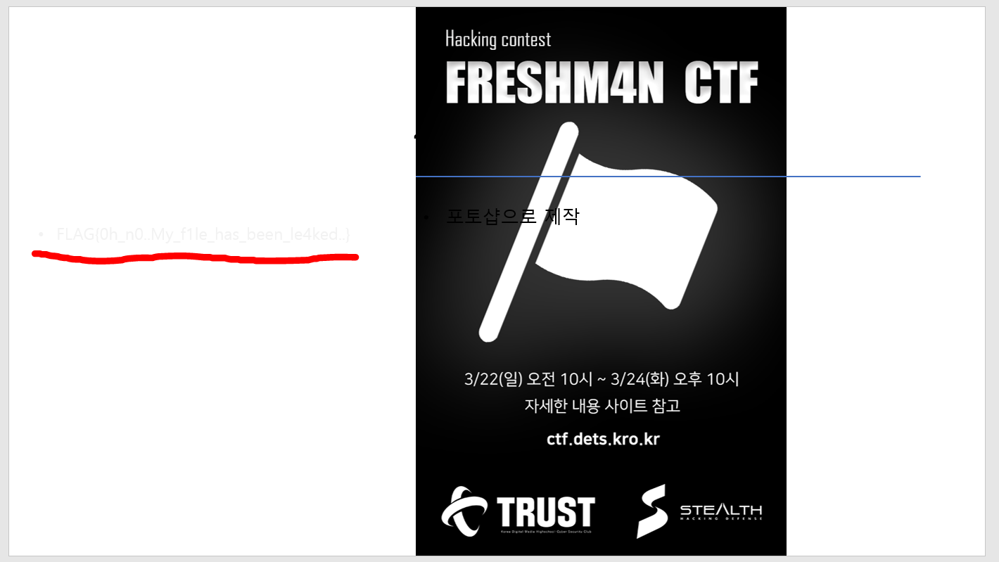

> `FLAG{0h_n0..My_f1le_has_been_le4ked..}`


# WEB

## Where is flag? (50)

http://198.13.38.185:5000/ 에 접속해 소스를 보면 주석으로 플래그가 있다.

> `FLAG{f12_1s_b4s1c_0f_W3bh4ck1ng!!}`

# PWN 

## 엔씨 (50)

nc dets.kro.kr 1001 접속하기만 하면 플래그를 준다.

> `FLAG{Y0u_kn0w_Nc_r3m0te~!}`

## Echo System~ (150)

nc dets.kro.kr 1234  
프로그램이 파이썬으로 돌아간다는 것을 쉽게 알 수 있다.  
이때 input 함수의 취약점을 이용해 프로그램이 돌아가는 경로의 파일들을 볼 수 있다.  

```
__import__('os').system('ls')
```


해당 경로에 flag 파일을 발견하였다. cat flag 로 플래그 내용을 읽어보자.


> `FLAG{$1mpl3_python_3sc4pe}`

## Indirect Dimigo Life (150)

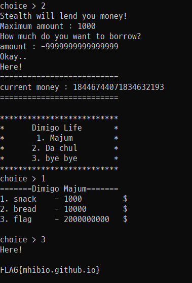

돈을 음수만큼 빌려서 돈을 불어나게 한다.

> `FLAG{mhibio.github.io}`

# Crypto

## 64th baseball game (100)

RkxBR3tUaDFzXzFzX0JAczJfNjRfIX0=  
base64로 decode 한다.

> `FLAG{Th1s_1s_B@s2_64_!}`

## Mother i want Daddy 5 (100)

5198c3410c3433273d21054af117fd11  
https://md5hashing.net/hash/md5 에서 decode 한다.

> `FLAG{M0mmy@!!!!!!_Daddy!!!_5_MD5}`

## S_in_RSP (100)

IODJ{FD2VDU_1V_W0R_2DCB}  
caesar 암호이다.

> `FLAG{CA2SAR_1S_T0O_2AZY}`

## 모스의 새로운 언어! (100)

```
· · – · 　· – · · 　· – 　– – · 　{　· – – · 　· – – · 　· · 　– · · · 　· · 　· – – · 　· · – – · – 　– 　· · · · 　· – – – – 　· · · 　· · – – · – 　· · 　· · · 　· · – – · – 　– – 　– – – – – 　· – · 　· · · 　– · – · – – 　}
```

모스부호를 해독한다.

> `FLAG{PPIBIP_TH1S_IS_M0RS!}`

## 진수의 새로운 언어! (100)

```
0100011001001100010000010100011101111011010010000100000101
00100001000001010111110100110101111001010111110100111000110
10001101101011001010101111100110001011100110101111101100010
011010010110111001100001011100100111100101111101
```

이진수를 string 으로 바꾼다.

> `FLAG{HAHA_My_N4me_1s_binary}`

## 위스키의 새로운 언어! (100)

```
70 76 65 71 123 72 48 72 48 95 84 104 49 115 95 49 115 95 97 115 99 105 105 33 125
```

모든 숫자들이 0~127 범위에 있는 것으로 보아 아스키 코드이다.

```
''.join([chr(int(i)) for i in '70 76 65 71 123 72 48 72 48 95 84 104 49 115 95 49 115 95 97 115 99 105 105 33 125'.split()])
```

> `FLAG{H0H0_Th1s_1s_ascii!}`

## It's easier than it looks.. (150)

```
UzNsemNrdDVjM0pMZVhOeVN6RnpLMHQ2TkhKTGVYTXJTM2x6Y2t0NWMzSkxlalJ5UzNsemNrdDVjM0pMZVhOeVVFUjNPRkJETVdSUWFqUXJUR2x6Y2t0NWMzSkxlVFIwVEZNd2RFeFRNSFJNVXpCMFRGTTBja3Q1YzNKTGVYTjFVR2x6Y2t0NWMzSkxlWE55UzNsemNrdDVjM0pMZVhOeVMzbHpja3Q1YzNKTWFuZHlTM2x6Y2t0NWMzSkxlWE55UzNsemNreHFOSFJNVXpCMFRGTXdkRXhUTUhSTVV6QjBURk13ZEV4VE1IUk1hbmQwVEZNd2RFeFRNSFJNVXpCMFRGTTBkRXhUTUhSTVV6QjBURk13ZEV4VE1IUk1VekIwVEZNd2RFeFROQ3RNVXpCMFRGTXdkRXhUTUhSTWFuZDBURk13ZEV4cU5ISkxlWE55UzNsemNrdDVjM0pMZVhOeVMzbHpja3Q1YzNKTGVUUjBURk13ZEV4VE1IUk1VekIwVEZNd2RFeFRNSFJNVXpCMFRGTTBkRXhUTUhSTVV6QjBURk13ZEV4VE1IUk1VekIwVEZNMGNreHBjM0pMZVhOeVRHbHpja3Q1YzNKTGVYTnlTM2x6Y2t4cWQzUk1halJ5UzNsemNrdDVjM0pMZVhOeVMzbHpja3Q1YzNWUVEzTnlTM2x6Y2t0NWMzSkxlWE55UzNsemNrdDVjM0pMZVhOeVMzbHpja3Q1YzNKTGVYTjFVR2x6Y2t0NWMzSkxlWE55UzNsemNreHFkM0pMZVhOeVMzbHpja3Q1YzNKTGVYTnlTM2x6Y2t0NWMzSk1hVEIwVEZNd2RFeFRNSFJNVXpCMFRGTXdkRXhUTUhSTVV6QjBURk13ZEV4VE1IUk1VekIwVEdrd2RFeFRNSFJNVXpCMFRGTXdkRXhUTUhSTWFqUjBURk13ZEV4VE1IVk1VekIwVEZNd2RFeFRNSFJNVXpCMFRGTXdkVXhUTUhSTVV6QjBUR3AzY2t0NU5IUk1VelFyUzNsemNrdDVjM0pMZVhOeVMzbHpja3Q1YzNKTGVYTnlTM2x6Y2t0NWMzSkxlWE55UzNsemNreG5QVDA9
```

주어진 문자열을 base64로 여러번 디코딩 하면...

```
++++++++++[>+>+++>+++++++>++++++++++<<<<-]>>>.++++++.-----------.++++++.>+++++++++++++++++++++++.<+++++++++++++.>-------------------.<-----------.--------------------.>---------.<----.>++++++++++++++++++++.--------------------.-----------------.+.+++++.+++++++++++.<-.>+++++++++++++++.<++++++++++++++++++++++++++++.>+++++++++++.<+++++++++++++++++++.-----------------------------.--------------.>------.--------------.------.<++.--.>++++++++++++++++++++++++++++++.
```

다음과 같은 문자열이 나오는데 이는 프로그래밍 언어 Brainfuck 의 소스코드이다.  
https://www.dcode.fr/brainfuck-language 이곳에서 decode 할 수 있다.

> `FLAG{ThI5_1s_NOT_0nLy_B4se_64}`

## 모스의 새로운 언어! 2 (150)

모스 부호가 담긴 mp3 파일이 주어진다. 문제 오류로 인해 불필요한 부호는 뺀다.  
소리 파형을 보면 다음 부호 소리가 날때까지의 소리가 길면 띄어쓰기이다.

> `FLAG{g00d 1ts mors t0}`

## Oh, DNA? (150)

```
GTGCGGGGCGTT{GGTTTCCGTCTGCGGTCAGGTTCTGAGT
CGGTA_GTACTATCT}
```

DNA 방식으로 암호화 되어있다. 구글링을 조금만 하면 해독 표를 볼 수 있는데, 세자리식 끊어서 해독하면

```
UAPV{R0BEA1R4I3S_SC4}
```
이런 문자열이 나오는데, caesar 암호화되어있다. key=14

> `FLAG{C0MPL1C4T3D_DN4}`

# Net

## 상어?상어! (150)

문제 제목이 힌트인데, 이는 wireshark 를 뜻한다.  
패킷 캡쳐를 시작하고 socket.exe 를 실행한 다음 follow tcp stream 한다.

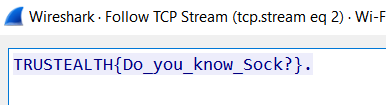

플래그 format 이 잘못되어 FLAG{} 로 고친다.

> `FLAG{Do_you_know_Sock?}`

# Forensic

## 트러스트 최고 (100)


이미지를 hex 값으로 보면 맨 아래에 플래그가 있다.

> `FLAG{TRUST_ga__jjjjjjj4ng!}`

## docx doc word?? (100)

문서 안에서 플래그를 찾아보라고 한다.

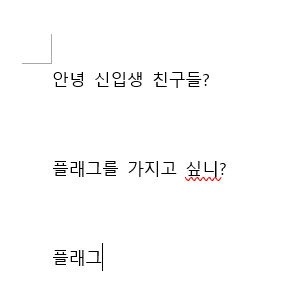

스크롤을 쭉 내리다보니...

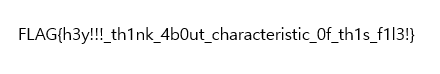

**가짜 플래그** 였다.

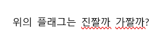

ㅋㅋㅋㅋㅋ  
진짜 플래그를 찾기 위해 docx 파일을 압축하고 다시 풀었다.  

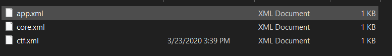

./docProps/ctf.xml 에 플래그가 숨어있었다.
> `FLAG{0h!!!_y0u_f1nd_1t!!!!!!!!}`

## 이름을 고치다 파일이 이상해졌어요 ㅠㅠㅠㅠ (250)

broken_file.txt 를 주는데 file header 가 png 여서 확장자를 png로 바꾸고 실행했더니


해당 주소로 갔더니 flag.png 파일을 주는데, 열 수 없다.  
flag.png 의 file header 가 FF FB 로 시작하길래 확장자를 mp3로 바꾸고 열어보았다.  
목소리가 역재생 되는듯한 소리가 나서 그 파일을 다시 역재생했더니 TTS가 플래그를 말해준다.

> `FLAG{wowy0ud1d1t}`

# Rev

## Hmm... dbg..? (100)

이번에도 문제에서 주어진 dbg.exe 의 hex 값에 플래그가 숨어있다.

> `FLAG{Th3_B3st_D3bugg3r_is_x96_dbg~}`

---

# EVENT

이벤트 문제이다. 문제는 총 4개인데 이는 힌트를 나누어서 주는 역할을 할 뿐 **플래그는 모두 동일**하다.

## My Chicken_1 (50)

```
2020년 3월 24일.. 이벤트로 신입생들한테 치킨쿠폰을 주려고했는데
QPSKVJALCKW이란 사람이 치킨쿠폰을 훔쳐갔어...
법적 처벌을 받아야하는데 관련된 정보를 얻기가 너무 힘들어 ㅜㅜ

얘랑 관련된 사람중에 유일한 사람을 찾아서 그 친구 전화번호로
관련된 정보좀 주세요라고 메세지를 보내면 될거같은데?
참고로 이친구는 개발 협업 사이트를 많이 이용했던거 같아!
```

개발 협업 사이트 = github 가 바로 떠올라 QPSKVJALCKW 를 github 에서 검색해보았다.  
한 유저가 검색되었고, QPSKVJALCKW가 팔로우하는 단 한 사람의 github 에 들어가보니 자기 소개에 블로그 링크가 있었고 그곳에는 페이스북 바로가기 버튼이 있었다.  
페이스북 자기소개에 전화번호가 있어 문제와 같이 '관련된 정보좀 주세요' 라고 보내니 첫번째 플래그 조각을 주었다.

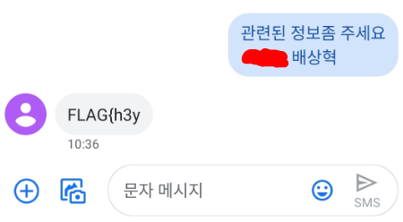  

첫번째 플래그 조각 : `FLAG{h3y`

다시 github으로 돌아가서, QPSKVJALCKW.github.io repo를 들어가보니  
index.html 파일은 아래와 같다. (주석 부분 위의 여러 줄의 공백은 삭제했어요)

```
<!DOCTYPE html>
<head>
  <title>Hello?</title>
</head>
<html>
  <iframe width="1280" height="720" src="https://www.youtube.com/embed/Klfo6Lw96Pw" frameborder="0" allow="accelerometer; autoplay; encrypted-media; gyroscope; picture-in-picture" allowfullscreen></iframe>
  <h1>Hnmmmmmm.....</h1>


<!--
['0x5c', '0x4d', '0x66', '0x3c', '0x2c', '0x7a', '0x38', '0x5d', '0x68', '0x4b', '0x4b', '0x7d', '0x7e', '0x58', '0x26', '0x6f', '0x7b', '0x46', '0x4d', '0x5a', '0x55', '0x6a', '0x6a', '0x3b', '0x22', '0x78', '0x68', '0x55', '0x45', '0x32', '0x30', '0x77', '0x4d', '0x27', '0x3b', '0x53', '0x7a']
['0x1a', '0x1', '0x27', '0x7b', '0x1f', '0x5a', '0x2', '0x7d', '0x4a', '0x14', '0x27', '0x4c', '0x15', '0x3d', '0x79', '0x4d', '0x5b', '0x69', '0x6d', '0x2a', '0x22', '0x4a', '0x50', '0x1b', '0x4c', '0x1d', '0x1f', '0x31', '0x2c', '0x5f', '0x59', '0x10', '0x22', '0x16', '0x9', '0x60', '0x4e']
-->
  </html>
```

## My Chicken_2 (50)

```
우리가 알아낸 정보에 의하면
QPSKVJALCKW는 자기가 평소에 유튜브를 즐겨봤는데
거기에 댓글들을 자주 달았다고 했어!
무슨 동영상을 즐겨봤을까?
```

위의 index.html 파일에서 유튜브 링크로 들어갔더니 QPSKVJALCKW 라는 계정으로 댓글이 쓰여있었다.

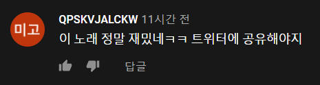

트위터에 들어가서 QPSKVJALCKW 라는 계정이 있는지 확인해보았다.

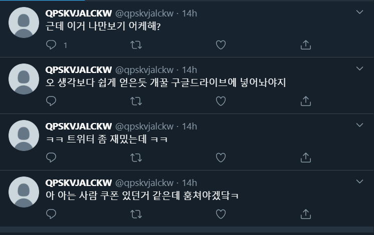


두번째 플래그 조각: `_d0_you`

## My Chicken_3 (50)

```
또하나 중요한 정보를 알아냈어!
QPSKVJALCKW은 아직 쿠폰을 안쓰고 자기 구글 계정에 저장했다는 소문이야 !
계정을 수사해보면 쿠폰을 다시가져올 수 있을거같은데
아이디는 이미 알고있는데 비밀번호를 모르겠네 ...

정보공개가능성이 있는 유일한곳은 블로그뿐인거같아
```
조금 전 index.html 파일의 끝에 적힌 주석을 보면 16진수로 되어있다.  
두개의 리스트를 각각 10진수로 바꾸면 
```
[92, 77, 102, 60, 44, 122, 56, 93, 104, 75, 75, 125, 126, 88, 38, 111, 123, 70, 77, 90, 85, 106, 106, 59, 34, 120, 104, 85, 69, 50, 48, 119, 77, 39, 59, 83, 122]

[26, 1, 39, 123, 31, 90, 2, 125, 74, 20, 39, 76, 21, 61, 121, 77, 91, 105, 109, 42, 34, 74, 80, 27, 76, 29, 31, 49, 44, 95, 89, 16, 34, 22, 9, 96, 78]
```

이렇게 되는데, 각각의 리스트에 대응하는 원소끼리 xor 연산을 하면 아래와 같다.

```
76 65 71 51 32 58 32 34 95 108 49 107 101 95 34 32 47 32 112 119 32 58 32 110 101 119 100 105 109 105 103 111 49 50 51 52 
```

모든 숫자가 0~127 범위에 있는것으로 보아 ascii code 임을 알 수 있다.
따라서 최종 코드는...

```
xor=[]
hex_a=['0x5c', '0x4d', '0x66', '0x3c', '0x2c', '0x7a', '0x38', '0x5d', '0x68', '0x4b', '0x4b', '0x7d', '0x7e', '0x58', '0x26', '0x6f', '0x7b', '0x46', '0x4d', '0x5a', '0x55', '0x6a', '0x6a', '0x3b', '0x22', '0x78', '0x68', '0x55', '0x45', '0x32', '0x30', '0x77', '0x4d', '0x27', '0x3b', '0x53', '0x7a']
hex_b=['0x1a', '0x1', '0x27', '0x7b', '0x1f', '0x5a', '0x2', '0x7d', '0x4a', '0x14', '0x27', '0x4c', '0x15', '0x3d', '0x79', '0x4d', '0x5b', '0x69', '0x6d', '0x2a', '0x22', '0x4a', '0x50', '0x1b', '0x4c', '0x1d', '0x1f', '0x31', '0x2c', '0x5f', '0x59', '0x10', '0x22', '0x16', '0x9', '0x60', '0x4e']

for i in range(1, len (hex_a)):
    xor.append(chr(int(hex_a[i], 0)^int(hex_b[i], 0)))
print("".join(map(str, xor)))
```

결과값은 `LAG3 : "_l1ke_" / pw : newdimigo1234` 인데, 맨 앞글자 F가 잘려나간듯 하다. (문제오류)  
세번째 플래그 조각: `_like_`

## My Chicken_4 (0)

```
결국 구글계정도 찾고 범인을 검거하는데 성공했어!
너가 모든 문제를 해결했다면 쿠폰 교환권을 되찾았을거야!

고마움의 표시로 되찾은 쿠폰 교환권을 우리에게 DM을 통해서주면 우리가 선물을 줄게!
```

트위터에서 QPSKVJALCKW 는 구글 드라이브에 쿠폰을 저장했다는 게시물을 올렸다. 그럼 QPSKVJALCKW.@gmail.com 으로 로그인을 하자.  
조금 전 계산을 통해 나온 문자열인 `newdimigo1234` 가 비밀번호 인듯 하다.


구글 드라이브에 들어가니 '교환권과 flag.png' 파일을 확인할 수 있었다.  
네번째 플래그 조각: `ch1ck3n????` (문제 오류로 인해 물음표가 하나 더 붙는다고 함)

최종 플래그!  
> `FLAG{h3y_d0_y0u_l1ke_ch1ck3n????}`

+치킨 쿠폰 감사합니다!!

---